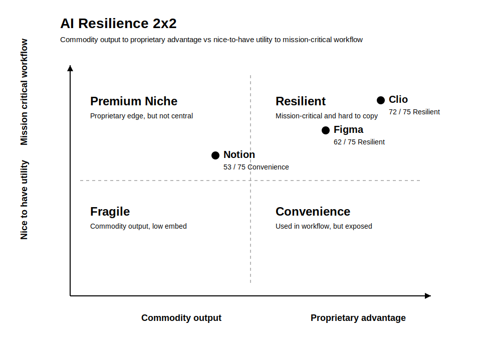

# AI Resilience Evaluator

`ai_resilience_evaluator` is a research-oriented skill for judging whether a company, product, business unit, or category owns durable value above commodity AI generation.

The core question is simple:

**Does this business own something that gets stronger as AI improves, or does it sit too close to commodity model output?**

## What This Is For

This repository contains a reusable agent skill for:

- company research
- startup screening
- product strategy
- competitive intelligence
- job-opportunity evaluation
- portfolio and market mapping

It is designed to work well for:

- single-company evaluations
- side-by-side company comparisons
- category scoring
- memo stress tests
- re-scoring after new launches or evidence
- ranked shortlists of candidate companies

## What The Skill Produces

Every evaluation is meant to return two things:

1. A readable narrative for humans
2. A structured object for downstream tooling or agent workflows

The narrative includes:

- Executive summary
- 2x2 placement
- Full score table
- Top strengths
- Main vulnerabilities
- Strategic read
- Final verdict
- Confidence level
- Evidence notes

## Core Framework

The evaluator uses a 2x2 and a fixed 75-point rubric.

### 2x2 Axes

- X-axis: `Commodity Output -> Proprietary Advantage`
- Y-axis: `Nice-to-Have Utility -> Mission-Critical Workflow`

### Quadrants

- `Fragile`: commodity output plus weak workflow importance
- `Convenience`: workflow usage exists, but the moat is still shallow
- `Premium Niche`: some proprietary advantage, but not central to recurring workflow
- `Resilient`: strong proprietary advantage plus mission-critical workflow position

### 15-Factor Rubric

The skill scores three categories from 1 to 5 per factor:

1. Proprietary advantage
   - context
   - trust
   - distribution
   - judgment
   - liability and governance
2. Workflow criticality
   - frequency
   - operational dependence
   - system position
   - switching cost
   - budget durability
3. AI resilience tests
   - model improvement test
   - wrapper risk test
   - agent readiness test
   - accountability test
   - outcome depth test

## What It Looks For

The evaluator raises scores when a business owns things like:

- proprietary workflow context
- trust in high-stakes domains
- distribution or routing power
- policy or domain judgment
- approvals, audits, or compliance handling
- real workflow embed
- accountability when AI is wrong
- stronger value as models improve

It lowers scores when the business looks like:

- a wrapper around generic models
- a polished but replaceable interface
- a draft generator that must be verified elsewhere
- a product with low switching cost
- a workflow-light tool with weak context or governance

It also calls out explicit red flags:

- Wrapper Illusion
- Workflow Thinness
- Trust Gap
- Context Weakness
- Agent Irrelevance
- Accountability Vacuum

## How The Skill Works

The default workflow is:

1. Normalize the target and the workflow it serves
2. Gather current evidence, starting with official materials
3. Identify moat layers
4. Assess workflow criticality
5. Run AI pressure tests
6. Score the 15-factor rubric
7. Place the target in the 2x2
8. Generate a strategic read and final verdict

When current facts matter, the evaluator is expected to use current-source research rather than stale memory.

## Example Prompts

- `Evaluate Datadog for resilience to AI disruption.`
- `Compare Clio, Notion, and Figma using the AI resilience rubric.`
- `Score this investor memo and tell me whether the moat is real.`
- `Reassess this company after its new agent product launch.`
- `Rank these six startups by AI resilience.`

## Repository Contents

- [SKILL.md](./SKILL.md): the reusable agent skill
- [README.md](./README.md): this human overview

## Current Status

The skill currently exists as a lean core `SKILL.md` without extra packaging. It has been validated locally with the SkillSkill validator.

## Why This Can Be Useful

A lot of AI analysis over-credits product polish, novelty, or “has AI features” positioning. This evaluator is meant to do the opposite:

- separate evidence from inference
- separate workflow depth from demo quality
- separate durable business layers from commodity generation
- force explicit scoring instead of vague admiration

That makes it useful for investors, operators, product leaders, and anyone trying to decide whether a company has a real moat in an AI-compressed market.
